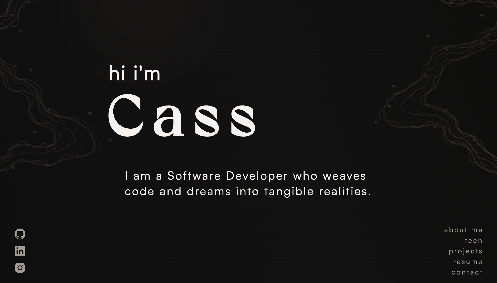

<div align='center'>
    
</div>
<h1 align='center'>
  hicass.dev - v2
</h1>
<p align='center'>
  The second version of <a href='https://www.hicass.dev/' target='_blank'>hicass.dev</a> built with <a href='https://nextjs.org/' target='_blank'>Next.js</a> and hosted with <a href='https://www.heroku.com/' target='_blank'>Heroku</a>
</p>

<div align='center'>
    
</div>


## Tech Stack

**Client:** 
- [React](https://react.dev/)
- [Next.Js](https://nextjs.org/)
- [Email.Js](https://www.emailjs.com/)
- [React Awesome Reveal](https://react-awesome-reveal.morello.dev/)
- [React Icons](https://react-icons.github.io/react-icons/)

**Server:** 
- [Node](https://nodejs.org/en)

**Deployment:**
- [Heroku](https://www.heroku.com/)

## Color Reference

| Color             | Hex                                                                |
| ----------------- | ------------------------------------------------------------------ |
| White |  #F6F2F0|
| Lightest Beige |  #a89c90 |
| Darkest Beige|  #625446 |
| Lightest Brown |  #4a3f33 |
| Brown |  #2e2c29 |
| Darkest Brown |  #292520 |
| Lightest Black |  #131212 |
| Darkest Black |  #0e0e0e |

There are other colors in between these that were used, please view the main.css file in src/app/styles/main.css to see the full list.

## Features

- A comprehensive look into who I am as a Developer and the projects I have created.
- Responsive Design.
- Contact form with email verification and sent confirmation message.


## Demo


## Environment Variables

To get the contact form to work using [Email.Js](https://www.emailjs.com/), you will need to add the following environment variables to your .env file

`NEXT_PUBLIC_EMAIL_KEY`

If you have an Email.Js account you can use thid variable to reference your Public Key that can be found in your user profile.


## Run Locally

Clone the project

```bash
  git clone https://github.com/hicass/portfolio-v2.git
```

Go to the project directory

```bash
  cd portfolio-v2
```

Install dependencies

```bash
  npm install
```

Start the server

```bash
  npm run dev
```

